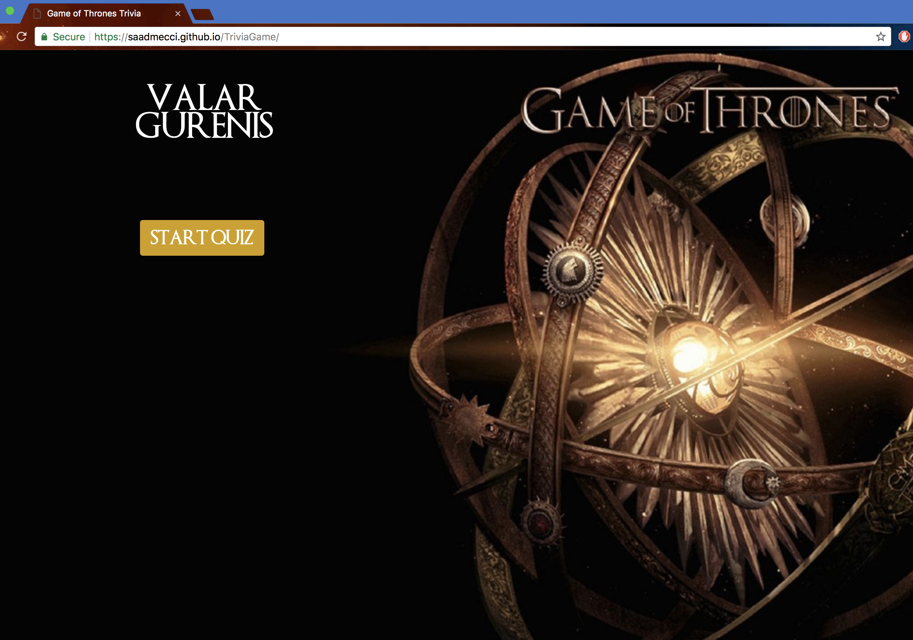
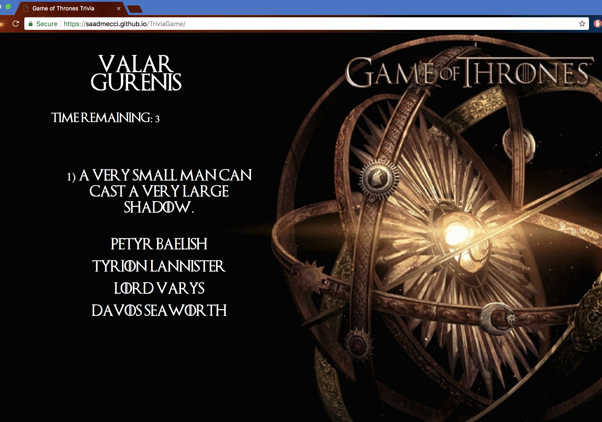
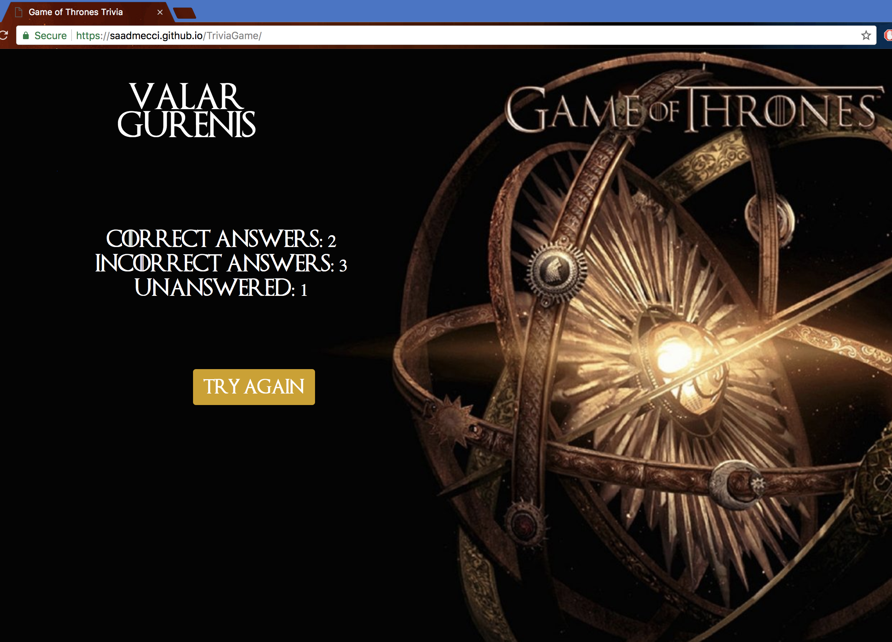

# TriviaGame

A  [Game of Thrones themed trivia](https://saadmecci.github.io/TriviaGame/) I created while enrolled in the Fullstack Bootcamp at UT.

It uses bootstrap and css for the layout and styling, and jQuery & javascript for the logic.

The website also uses a custom Game of Thrones font in ttf format.

It can be modified fairly easily to increase the number of questions in the trivia.

The following image displays what the users will see when they first visit the site:

When the user clicks on the **Start Quiz** button, the trivia begins.

The first question is displayed and a 10 second countdown gets displayed on the page:

Once the end of the trivia is reached, the site will display the number of correct, incorrect, and unanswered questions.

If the **Try Again** button is clicked, the results are refreshed and quiz is restarted.

